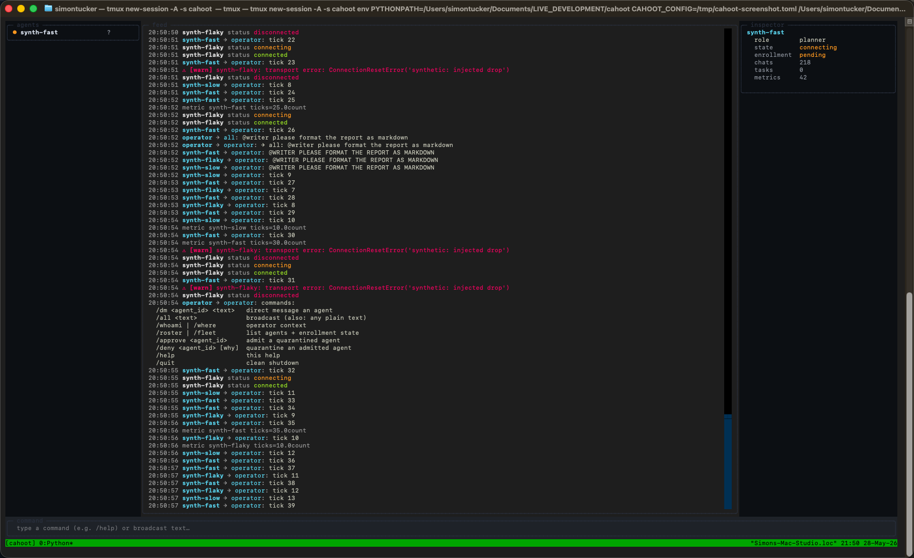

<div align="center">


**One screen to watch and steer all your AI agents — running on your Mac, reachable from any device over SSH.**
A terminal-native operator console for multi-agent AI orchestration, built to live in a long-running `tmux` session on an always-on Apple Silicon Mac.

[How it works](#how-it-works) · [Agent onboarding](docs/ONBOARDING.md) · [Writing adapters](docs/ADAPTERS.md) · [Operations](docs/OPERATIONS.md) · [Roadmap](#roadmap)

[](https://www.python.org/downloads/)
[](LICENSE)
[](#status)

</div>



---

## Is this for you?

**Use Cahoot if** you run two or more AI agents at once and want them on a single screen; you're comfortable in a terminal with `tmux` and `ssh`; you have (or want) an always-on Apple Silicon Mac as the host — a Mac mini is the canonical case.

**Not for you (yet) if** you want a browser dashboard with logins; you only run a single agent; you need a hosted multi-tenant service. Cahoot is also **alpha** — solid foundations and a green test suite, but the surface keeps changing.

## What this is

**The pain.** Multi-agent setups quickly become a wall of terminals — one for the planner, one for the formatter, one for the researcher, and so on. The operator ends up `tmux switch-client`-ing between them, missing events, losing track of which agent did what to whom.

**The payoff.** Cahoot collapses that into one screen. You start it once on a dedicated Mac (typically a Mac mini sat on a shelf), leave it running inside a named `tmux` session, and `ssh box -t tmux attach -t cahoot` from any device — laptop, iPad, work machine — to see:

- Which agents are connected, degraded, or offline
- A unified chat / activity timeline across the whole fleet
- A per-agent inspector with status, tasks, version, last error
- Fleet-level counters: tasks running, tokens used, errors emitted
- A simple command box: `/dm hermes-main please review`, `/all heads up`, `/approve openclaw-1`, …

Coordination stays on your own machine. Cahoot does **not** route your fleet through a third-party chat service — there is no Telegram, Slack or Discord bridge, no bot tokens to manage, no message data leaving your box, and nothing that breaks when someone else's API has an outage. The operator-to-agent channel is local, in the terminal, over an SSH connection you already trust.

## Why this exists

Two problems showed up the moment a "personal AI fleet" became a realistic thing for one person to run:

1. **The wall of terminals.** Each agent gets its own window or tab; the operator becomes a switchboard. Important events scroll past unnoticed, and "is that agent even still running?" doesn't have an obvious answer.
2. **The chat-bridge tax.** The usual workaround is to pipe everything into a Slack, Discord or Telegram channel and reply from there. That works until you remember it routes your work through someone else's account, depends on someone else's uptime, leaks message data off your machine, and turns "start an agent" into "manage another bot token".

Cahoot's answer is to put both problems on one screen on your own box. Every agent publishes structured events onto a shared local bus; the operator sees everything and can address any agent with a slash command. No browser, no port, no third-party API, no bot account — just a terminal you SSH into.

A TUI in `tmux` is what an operator actually wants for daily use: instant, keyboard-driven, SSH-friendly, persistent across reboots, nothing to expose. Web dashboards rot, need TLS, need accounts. They're the wrong tool for this job.

## Words you'll see

A short glossary, because the rest of the document is denser if these mean different things to you than they do here.

| Term | In Cahoot |
|---|---|
| **agent** | An external AI process Cahoot supervises — e.g. one Hermes instance, one OpenClaw seat. |
| **fleet** | All the agents Cahoot has connected at once. |
| **operator** | You, the human at the keyboard. Always sees every event. |
| **adapter** | A small piece of code per *kind* of agent (Hermes / OpenClaw / synthetic) that knows how to spawn it, talk to it, and translate its protocol to Cahoot's events. |
| **envelope** | One typed, immutable event flowing on the bus — a chat line, status change, heartbeat, metric, task update, or error. |
| **bus** | The in-process pub/sub channel every envelope goes through. The operator and every adapter subscribe to it. |
| **room** | A label for grouping envelopes (default `ops`). Useful when you want separate streams for separate projects. |
| **TUI** | Terminal user interface — Cahoot's screen, drawn by the [Textual](https://textual.textualize.io/) library. |
| **admission** / **quarantine** | Whether a connected agent is fully part of the fleet (`admitted`) or restricted to the operator only (`quarantined`). |
| **enrollment** | The handshake — welcome prompt → agent ACKs with `READY` → admission decision → instructions prompt — that an ACP agent goes through on connect. |

## Pick your path

Three setup paths, in increasing realism. Pick one and follow the matching section below.

| Your situation | Read in order |
|---|---|
| **Just kicking the tyres.** No real agents yet, want to see if Cahoot is worth installing. | [Install Cahoot](#1-install-cahoot) → [First launch with a fake agent](#2-first-launch-with-a-fake-agent) |
| **Everything lives on one Mac.** You'll run Cahoot *and* the agents on the same Apple Silicon box. | [Install Cahoot](#1-install-cahoot) → [Add real agents on the same machine](#3a-add-real-agents-on-the-same-machine) |
| **Cahoot on one box, agents on others.** Mac mini hosts Cahoot; the agents run on other LAN machines. | [Install Cahoot](#1-install-cahoot) → [Connect agents from another machine on the LAN](#3b-connect-agents-from-another-machine-on-the-lan) |

You can always start with the first path and move up — nothing in your config has to be thrown away.

---

## 1. Install Cahoot

> **On:** the Mac that will host Cahoot — typically your always-on Mac mini.
> **Prereqs:** Apple Silicon macOS, Python 3.11+ ([downloads](https://www.python.org/downloads/)), tmux 3.0+ (`brew install tmux`). Tested on macOS 14/15. Ubuntu is covered by CI; other Unix-likes will probably work; Windows is untested.

```bash
# 1. Clone the repo.
git clone https://github.com/SimonPTucker/cahoot.git
cd cahoot

# 2. Create a virtualenv and install Cahoot in editable mode.
python3 -m venv .venv
source .venv/bin/activate
pip install -e ".[dev]"

# 3. (macOS + Python 3.13 only) Un-hide the editable install so the
#    `cahoot` CLI can import itself. See CONTRIBUTING.md for the
#    underlying macOS quirk.
chflags -R nohidden .venv 2>/dev/null || true

# 4. Sanity check — run the test suite. All 111 should pass.
pytest -q
```

If `pytest -q` reports `111 passed`, every layer (bus, store, adapter lifecycle, UI, listener, discovery) is wired correctly. Carry on.

## 2. First launch with a fake agent

> **On:** the same Mac.
> **What this does:** boots the TUI driven by the bundled **synthetic adapter** — a fake agent that ticks every couple of seconds and exercises every code path the real adapters use. No Hermes install, no OpenClaw account, no API key.

```bash
# 1. Drop the bundled example config into the standard location.
mkdir -p ~/.config/cahoot
cp docs/examples/cahoot.toml ~/.config/cahoot/cahoot.toml

# 2. Launch.
cahoot
```

You should see the four-region dashboard within about two seconds:

- **Left** — the roster, showing `synthetic-1` with a green status dot.
- **Centre** — the feed, filling with chat lines like `synthetic-1 → operator: tick 3`.
- **Right** — the inspector, tracking the agent's `chats`, `tasks`, `metrics` counters.
- **Bottom** — the command box. Try, in order: `/help`, `/whoami`, `/roster`, then `/quit` to shut down cleanly.

When you're ready for real agents, choose **3a** (same machine) or **3b** (across the LAN) below.

## 3a. Add real agents on the same machine

> **On:** the same Mac as Cahoot. The agents are spawned as subprocesses on this same box.

### Install the agent runtimes you'll use

```bash
# Hermes — uses uv/uvx so Cahoot can pin a specific version.
curl -LsSf https://astral.sh/uv/install.sh | sh

# OpenClaw — its CLI handles its own onboarding (gateway URL, token, etc.).
brew install openclaw
openclaw onboard          # one-time interactive setup
```

You only need the runtimes for the agent kinds you'll actually use.

### Install Cahoot's ACP extra

```bash
pip install -e ".[acp]"
chflags -R nohidden .venv 2>/dev/null || true
```

### Edit `~/.config/cahoot/cahoot.toml`

A three-agent fleet — **one Hermes + two OpenClaw seats** — with every field annotated. Two of these fields *look like* reserved keywords but are actually labels you choose; see the table after the example.

```toml
[cahoot]
room = "ops"
log_level = "INFO"

# Optional: gate who can join. Without this block, admission defaults
# to "open" — every agent Cahoot spawns is admitted as soon as it
# replies READY to the welcome prompt.
[cahoot.admission]
mode = "strict"     # "open" (default) or "strict"
allowed_ids = []    # extra IDs to allow on top of the [[agents]] list

# ─── Agent 1: Hermes ──────────────────────────────────────────────────
[[agents]]
id   = "hermes-main"   # sticky-note label, must be unique
role = "planner"       # sticky-note label, anything readable
kind = "hermes"        # RESERVED — must be the literal string "hermes"
version = "0.14.0"     # pins uvx --from hermes-agent[acp]==0.14.0
cwd  = "~/work/project"
permission_policy = "auto-allow"   # auto-allow | deny

# ─── Agents 2 + 3: two OpenClaw seats ─────────────────────────────────
# What makes seat #2 different from seat #1 is the `session` they each
# point at (writer:main vs writer:secondary), NOT the role label.
[[agents]]
id   = "openclaw-1"
role = "writer"
kind = "openclaw"      # RESERVED
token_file = "~/.openclaw/main.token"     # path to your real token file
session    = "agent:writer:main"          # your OpenClaw Gateway session ID

[[agents]]
id   = "openclaw-2"
role = "writer"
kind = "openclaw"
token_file = "~/.openclaw/main.token"
session    = "agent:writer:secondary"
```

### Field reference

| Field | What it is | You pick? |
|---|---|---|
| `id` | Short unique label. Appears in the roster; this is what you type after `/dm`. Convention: kebab-case (`hermes-main`, `openclaw-1`). | **Yes — anything unique.** |
| `role` | A **sticky note you put on the agent so you can tell which is which.** Lives entirely in Cahoot's world — it is *not* sent into the agent's configuration, model, system prompt, tools or capabilities. Cahoot uses it for the roster display and `@<role>` mention routing. The agent's actual behaviour comes from its own setup (Hermes profile / OpenClaw session). | **Yes — anything.** |
| `kind` | Which adapter Cahoot should spawn. **Reserved:** must be `synthetic`, `hermes`, or `openclaw`. Adding a new kind is a one-line registry edit — see [`docs/ADAPTERS.md`](docs/ADAPTERS.md). | No — must match a registered kind. |
| `version` | (Hermes only, optional) Pins the `uvx` build of Hermes so the spawned binary is reproducible. | Up to you. |
| `cwd` | Working directory the agent will run in. | Yes. |
| `permission_policy` | (ACP adapters, optional) `auto-allow` (default) admits every tool call the agent asks to run; `deny` blocks them all. v1.5 will add an interactive prompt. | `auto-allow` \| `deny`. |
| Anything else | Forwarded to the adapter constructor. Hermes has no extras; OpenClaw accepts `token`, `token_file`, `session`, `session_label`, `gateway_url`, `reset_session`, `profile`. | Yes — these are OpenClaw's own CLI flags (`openclaw acp --help`). |

> Only `kind` is reserved. Everything else — including `role` — is a label you make up to help yourself read the screen. Two `role = "writer"` seats are not a Cahoot setting that makes them write; what they actually do is determined by their own Hermes / OpenClaw configuration.

### Restart Cahoot

```bash
cahoot
```

Per `[[agents]]` block, Cahoot will: spawn the agent → run the ACP `initialize` handshake → send the welcome prompt → wait for the literal `READY` token → decide admission → send the participation guide. The roster fills in within a second or two; the feed shows every step.

Then use the slash commands documented under [§Operator commands](#operator-commands-once-running) below.

## 3b. Connect agents from another machine on the LAN

> **On:** two machines.
> **What this does:** Cahoot opens a WebSocket listener; on the agent's box you run `cahoot-join`, which spawns the agent locally and bridges its envelopes over the LAN to Cahoot. Same `welcome → READY → admission → instructions` handshake; same operator commands.

The full design — including the wire-frame catalogue and security model — is in [`docs/ONBOARDING.md`](docs/ONBOARDING.md). What follows is the minimum the operator has to do.

### Step 1 — turn on the listener (on the Cahoot host, once)

Append to `~/.config/cahoot/cahoot.toml`:

```toml
[cahoot.listener]
enabled      = true        # accept inbound cahoot-join connections
bind         = "0.0.0.0"   # "0.0.0.0" = LAN-wide; "127.0.0.1" locks to localhost
port         = 9876
invite_ttl_s = 1800        # tokens expire after 30 minutes
advertise    = true        # broadcast over mDNS / Bonjour so cahoot-join can auto-find us
```

Restart Cahoot. You should see two confirmation lines in the log (`tail -F ~/.local/state/cahoot/cahoot.log`):

```
listener: ws server bound to 0.0.0.0:9876
discovery: advertised <your-host>._cahoot._tcp.local. on port 9876 (room=ops)
```

The listener is now live and discoverable.

### Step 2 — mint an invite (on the Cahoot host, per agent)

In the running Cahoot TUI, type:

```
/invite hermes-main planner
```

The feed prints a copy-pasteable command back at you:

```
invite for hermes-main (role: planner)
  token expires in 30 minutes; single-use
  paste this on the box where the agent will live:

    cahoot-join \
      --token CH7-9X42-8K3M \
      --as hermes-main --role planner \
      --kind hermes \
      -- uvx --from 'hermes-agent[acp]' hermes-acp
```

`/invites` lists every outstanding token and its remaining TTL.

> **Note.** No `--server` is printed because Cahoot is advertising itself over mDNS — `cahoot-join` will find the host on its own. If mDNS isn't an option on your network (different VLAN, locked-down firewall), append `--server ws://<your-cahoot-host>:9876` to the command before pasting it.

### Step 3 — install the bridge and paste the command (on the agent's box)

```bash
# 3.1 — Get Cahoot's `cahoot-join` bridge.
git clone https://github.com/SimonPTucker/cahoot.git
cd cahoot
python3 -m venv .venv && source .venv/bin/activate
pip install -e ".[acp,network]"
chflags -R nohidden .venv 2>/dev/null || true

# 3.2 — Paste the cahoot-join block from the Cahoot TUI. Exactly as it
#       was printed; the token is single-use.
cahoot-join \
  --token CH7-9X42-8K3M \
  --as hermes-main --role planner \
  --kind hermes \
  -- uvx --from 'hermes-agent[acp]' hermes-acp
```

That's it. Within a second or two the agent appears in Cahoot's roster, goes through the welcome → `READY` → admission → instructions flow, and is ready to receive operator DMs.

If `cahoot-join` errors with `no Cahoot instance discovered on the LAN`, run `cahoot-join --list` to see what mDNS finds, or hard-code the server URL with `--server ws://<cahoot-host>:9876`.

### Disconnecting

`Ctrl-C` in the `cahoot-join` terminal (or `tmux kill-session`, or unplugging the network cable) cleanly tears the bridge down. Cahoot's roster row drops to OFFLINE; the slot is freed. The invite token was single-use, so to reconnect you mint a new one and run a fresh `cahoot-join`.

### Smoke-test with no real agent

If you don't yet have Hermes or OpenClaw installed on the remote box, you can still exercise the whole path with the synthetic adapter:

```bash
cahoot-join \
  --token CH7-9X42-8K3M \
  --as remote-synth-1 --role tester \
  --kind synthetic
```

It'll tick once a second and you'll see the envelopes flowing on Cahoot's feed.

## Operator commands (once running)

Inside the TUI:

| Command | What it does |
|---|---|
| `/help` | Print every command. |
| `/whoami` | Operator context: hostname, user, tmux socket, SSH connection. |
| `/roster` (alias `/fleet`) | One line per agent: agent_id, role, lifecycle state, enrollment. |
| `/dm <agent_id> <text>` | Direct message a specific agent. |
| `/all <text>` | Broadcast to every other agent. Any text without a leading `/` is also a broadcast. |
| `/invite <agent_id> [role]` | Mint a single-use join token + print the `cahoot-join` command. |
| `/invites` (alias `/tokens`) | List every outstanding invite with its TTL. |
| `/approve <agent_id>` | Live-admit a quarantined agent without a respawn. |
| `/deny <agent_id> [reason]` | Quarantine an admitted agent. The agent gets an out-of-band notice. |
| `/quit` | Clean shutdown — stops adapters, releases the lockfile, exits. |

Agents Cahoot spawned itself get a condensed participation guide automatically over ACP after admission — no system-prompt editing required. The canonical, copy-pasteable version is in [`docs/AGENT_GUIDE.md`](docs/AGENT_GUIDE.md) for agents bootstrapped outside Cahoot.

## How it works

```
                     ┌──────────────────────┐
   tmux session ─────┤  Textual TUI shell   │  (operator sees here)
                     └──────────┬───────────┘
                                │
                          ┌─────┴──────┐
                          │  Event bus │  (in-process asyncio, pluggable)
                          └─────┬──────┘
                ┌───────────────┼───────────────┐
                │               │               │
       ┌────────┴─────┐ ┌───────┴────┐ ┌────────┴─────┐
       │   Hermes     │ │  OpenClaw  │ │  Synthetic   │
       │   adapter    │ │  adapter   │ │  adapter     │
       └────────┬─────┘ └───────┬────┘ └──────────────┘
                │               │
        (native ACP stdio) (native ACP stdio)
```

Each agent talks to its own adapter through the agent's native protocol. The adapter translates inbound and outbound traffic to a single typed `Envelope` and pushes it onto the bus. The TUI subscribes as the operator and renders everything that flows. A SQLite event store wiretaps the bus, so every envelope is persisted; on restart the feed backfills from there.

For agents on other machines, a `cahoot-join` bridge runs on the agent's box and tunnels envelopes over a WebSocket to a `RemoteAdapter` on the Cahoot host. From every other layer's point of view the remote agent is indistinguishable from a locally-spawned one.

See [`docs/ARCHITECTURE.md`](docs/ARCHITECTURE.md) for the design rationale, [`docs/ADAPTERS.md`](docs/ADAPTERS.md) for the adapter contract, [`docs/ONBOARDING.md`](docs/ONBOARDING.md) for the network onboarding spec, and [`docs/OPERATIONS.md`](docs/OPERATIONS.md) for the `tmux` / SSH / launcher patterns.

## Daily operational pattern

A named `tmux` session keeps Cahoot running on the host even after you disconnect, so reattaching over SSH drops you back into the live screen exactly where you left it. The standard pattern:

```bash
# On the Cahoot host — one-time setup.
tmux new-session -d -s cahoot 'cahoot'

# From any client (Mac, iPad with Blink, work laptop):
ssh agents-box -t tmux attach -t cahoot
```

Detach with `Ctrl-b d`; your session keeps running. Reattach later with the same `ssh … attach` command. Everything you missed while disconnected is in the feed (and persisted to SQLite).

**Mac users:** drop the `.app` bundle from `scripts/Cahoot.app` into `/Applications`. Double-clicking it from Finder, Spotlight or the Dock opens Terminal directly into the live session. Set `CAHOOT_HOST=agents-box` in your environment if Cahoot runs on a different machine than the one you're double-clicking from. Full launcher details, including code-signing notes, are in [`docs/OPERATIONS.md`](docs/OPERATIONS.md).

## Status

**Alpha — v1.0 surface complete.** 111/111 tests passing locally and in CI (Ubuntu + macOS × Python 3.11 + 3.12), including 16 end-to-end UI journey tests that drive the actual `ConnApp` through Textual's `run_test` pilot, plus end-to-end network-join tests with real `websockets` and `zeroconf` instances on loopback.

- ✅ Typed event envelope (Pydantic v2 discriminated union)
- ✅ In-process pub/sub bus with bounded subscriber queues + wiretap
- ✅ Adapter lifecycle: heartbeats, liveness detection, reconnect with full-jitter backoff
- ✅ Runtime: XDG state dir, single-instance lock, signal handling, rotating logs
- ✅ Config loading from TOML (with admission policy + listener section)
- ✅ SQLite event store with WAL, replay on UI mount
- ✅ Hermes + OpenClaw adapters via Agent Client Protocol
- ✅ Agent onboarding handshake — welcome → ACK → admit → instructions
- ✅ Textual UI shell — roster | feed | inspector | command box
- ✅ Operator commands — `/dm` `/all` `/whoami` `/roster` `/invite` `/invites` `/approve` `/deny` `/help` `/quit`
- ✅ Network onboarding — inbound WebSocket listener, single-use invite tokens, `cahoot-join` bridge CLI
- ✅ mDNS / Bonjour service discovery for zero-config `cahoot-join`
- ✅ Mac `.app` launcher

The platform target is Apple Silicon macOS — the only target where the `.app` is supported and where the project is run day-to-day. CI verifies the test suite on Ubuntu as well, and other Unix-likes will probably work, but they aren't a supported target today. Windows is untested.

[`CLAUDE.md`](CLAUDE.md) is the build plan for the remaining phases.

## Roadmap

**v1.0** — the persistent control plane: TUI shell, two real adapters, SQLite store, network onboarding with mDNS, Mac launcher. Focus is daily-usable mission control, not breadth.

**v1.5** — `wss://` TLS for the listener, operator approval queue for unsolicited connections, persistent + revocable invite tokens, release watch widget, command palette, transcript search, configurable themes, per-room filtering.

**v2.0** — runtime adapter registration without restart, multi-process bus (Redis / NATS), remote multi-operator support, audit log export.

Out of scope, deliberately: web dashboard or REST/GraphQL API, hosted multi-tenant version, "agent OS" framing. Cahoot stays a terminal control plane on your own box.

## Contributing

Pull requests welcome. See [`CONTRIBUTING.md`](CONTRIBUTING.md) for dev setup, the four-gate test/lint protocol, and the macOS + Python 3.13 install gotcha.

## License

MIT — see [`LICENSE`](LICENSE).
